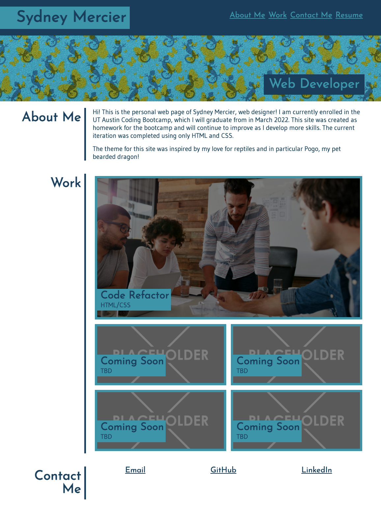

# Sydney Mercier's Portfolio Page

First Deployed: December 21, 2021

Published: GitHub https://sygmo.github.io/sydney-portfolio/

Technologies: HTML, CSS

# Summary:

This project is a personal portfolio website made completely from scratch for a UT Coding Bootcamp assignment. I intend to make real use of it in the future, so it is very much a work in progress. 

All links work, including the link to my resume, and the layout is responsive and will appear differently on mobile. 